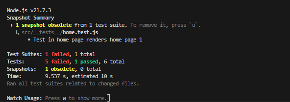

# Express.js Unit Test

This is a unit testing file using Jest and testing-library/react

## Getting Started

Follow these instructions to run this test on your local machine.

- [Jest](https://jestjs.io/)

### Run

```bash
npm jest
```

### Test Case

Test in home page

```bash
Test in home page
# Some test case to test render and components in HOME PAGE
- renders home page and components
- renders modal generate job
- renders modal add job
- renders form job
- expect filter job
- download jobs data

```

Test in layout

```bash
# Case to test render and components in LAYOUT
- renders layout

```

### Result



```

```
